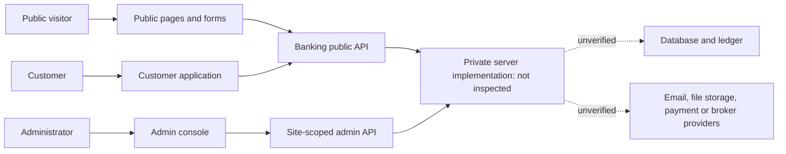

# Reference site feature inventory

Reference: https://classicdemoonline.wsizsh.com/
Inspection date: 6 October 2026

This report catalogs public page content, publicly delivered browser code, and the API contracts that code references. It is not a backend source audit. No accounts were created, forms submitted, payments made, private records retrieved, or authentication controls bypassed. An interactive browser was unavailable, so visual layout and successful end-to-end operation were not tested.

Evidence labels:

- **Public content:** present in returned HTML or a public configuration response.
- **Client code:** a form, branch, action, or API call is implemented in delivered JavaScript. This does not establish that its server endpoint works or that it is enabled for every account.
- **Advertised:** promotional or policy text with no verified implementation.
- **Unknown:** requires authorized customer/admin access or backend source.

## 1. Site identity and shared interface

The normal public configuration request returns the name **Online B@nking Demo**, slug `classicdemoonline`, primary currency **USD**, and support mode **builtin**. Brand color is unset; theme and content overrides are empty. Configured contact email, phone, address, and hours are null. Therefore, generic contact details or branding in page fallback content should not be treated as verified operational details. [Public site configuration](https://classicdemoonline.wsizsh.com/api/banking-public/site-info)

| Feature | How it operates | Evidence |
|---|---|---|
| Responsive navigation | Desktop links and Services dropdown; mobile navigation with expandable services and bottom account-access buttons. | Client code |
| Site branding | Components consume site name, logo, brand color, and currency from configuration. | Client code + public configuration |
| Light/dark appearance | Theme switch changes the interface and persists a local preference; system theme support is included in the shared theme library. | Client code |
| Configurable page content | A content provider supports field replacements, hidden sections, and ordering. Current public overrides are empty. | Client code + public configuration |
| Member navigation | A successful `/me` response replaces login/register actions with account name/avatar, Dashboard, Profile, and Sign Out. | Client code |
| Sign out | Posts `/auth/logout` through the banking API wrapper, then returns home. | Client code |
| Feedback states | Loading overlays, disabled submit buttons, inline field errors, success/error notifications. | Client code |
| Translation | A GTranslate component/wrapper is included. Available languages and actual translation execution were not verified. | Client code |
| Homepage carousel | Hero backgrounds rotate about every five seconds; Previous and Next controls are provided. | Client code |
| Footer navigation | Product, information, support, privacy, and terms links. Sitemap points to the homepage. Social destinations are placeholders. | Public content |

Sources: [Public shell](https://classicdemoonline.wsizsh.com/_next/static/chunks/2kpcdqqdflz6y.js), [homepage interactions](https://classicdemoonline.wsizsh.com/_next/static/chunks/1e73ujmn4q7up.js).

## 2. Public pages and product presentation

The product descriptions below are **advertised offerings**, not evidence of real bank accounts, payment-network integrations, insurance, or regulatory authorization.

| Page | Features/content | What its actions do |
|---|---|---|
| [Home](https://classicdemoonline.wsizsh.com/) | Hero carousel; product and benefit cards; onboarding explanation; sample balances, transactions, and charts; security and promotion sections. | Main CTAs open registration/login/contact. Several Learn More, Calculate Returns, and Security Center links are `#` placeholders. The illustrated account figures are marketing examples. |
| [About](https://classicdemoonline.wsizsh.com/about) | Mission, values, history, customer/assets/branch statistics. | Opens registration or contact. Statistics are unverified marketing content. |
| [Personal banking](https://classicdemoonline.wsizsh.com/services/personal) | Checking, high-yield savings, money market, CDs, IRA, youth savings; digital banking, alerts, bill pay descriptions. | All account-opening CTAs go to the same registration flow; advisor CTA goes to contact. |
| [Business banking](https://classicdemoonline.wsizsh.com/services/business) | Business checking/savings, loans/cards, merchant services, treasury/cash management, reporting, employee cards, relationship managers. | Business account CTA goes to standard registration; advisor CTA goes to contact. |
| [Loans](https://classicdemoonline.wsizsh.com/services/loans) | Home, auto, personal, business, student, home-equity products; repayment calculator; application explanation. | Product Apply Now links scroll to `#apply`; final CTA opens registration. |
| [Cards](https://classicdemoonline.wsizsh.com/services/cards) | Cashback, travel, business, student, secured, debit card catalog and benefits. | Apply/Get Card opens registration; Compare Cards opens contact. |
| [Grants](https://classicdemoonline.wsizsh.com/services/grants) | Small-business, education, homeownership, emergency, community, healthcare assistance descriptions. | Learn More scrolls to `#apply`; application CTA opens registration. Described document review/disbursement is not verified here. |
| [Mobile app](https://classicdemoonline.wsizsh.com/apps) | Promotes summaries, history/statements, transfers, Zelle/wires, bill pay, mobile check deposit, card controls, budgeting. | App Store and Google Play buttons are `#` placeholders; no installable app was demonstrated. |
| [Contact](https://classicdemoonline.wsizsh.com/contact) | Required name, email, message; optional subject. | Trims inputs, lowercases email, posts contact data, disables controls while sending, displays feedback, and clears form on success. Submission was not executed. |
| [FAQ](https://classicdemoonline.wsizsh.com/faq) | About, Account, Deposit, Withdrawal, Referral, Additional tabs; expandable questions. | Changes categories and expands one question at a time. Some answers concern crypto robots/referral investment commissions rather than the banking products, so they are unreliable as an implementation specification. |
| [Privacy](https://classicdemoonline.wsizsh.com/privacy) | Describes data collection, use, sharing, cookies, security, rights, third parties, children. | Informational text; actual retention and privacy controls remain unknown. |
| [Terms](https://classicdemoonline.wsizsh.com/terms) | Eligibility, account responsibilities, electronic notices, liability, changes, governing law. | Informational text. Footer Security also links here. |

The loan calculator is entirely local JavaScript. It parses principal, annual percentage rate, and years; requires each to be greater than zero; computes monthly rate `APR / 100 / 12` and payments `years * 12`; applies the standard amortization formula; and shows monthly payment, total repayment, and interest. It does not request a loan quote from a server. Zero-interest input is not handled by this calculation branch. [Calculator source](https://classicdemoonline.wsizsh.com/_next/static/chunks/3dm8hs_8s0knj.js)

Contact transport is `POST /api/banking-public/contact`. Server storage, notification delivery, and staff response are unknown. [Contact source](https://classicdemoonline.wsizsh.com/_next/static/chunks/22tidw5ss3l0u.js)

## 3. Registration, sign-in, and account recovery

All operations in this section are **client code evidence** unless stated otherwise. API paths are prefixed with `/api/banking-public`.

| Feature | Inputs and operation | Server contract referenced |
|---|---|---|
| Sign in | Email-or-username field, password, show/hide password, loading/error states. | `POST /auth/login` with `email`, `password` |
| Existing session | Login/registration checks for a current account and sends authenticated visitors to the dashboard. | `GET /me` |
| Conditional login routing | Routes to 2FA, email verification, PIN checkpoint, or dashboard according to response flags. | `needs_2fa`, `needs_email_verification`, `pin_gate` |
| Restricted-account notice | Displays server message and account status. If `allow_proceed` is true, Continue retries with acknowledgement; Cancel clears password. | `account_restricted`, `account_status`, `acknowledge: true` |
| Blocked-account response | Displays a restriction/support message. | `account_blocked` error |
| Registration wizard | Four steps with Back/Next and progress: Personal, Contact, Account, Security. | `POST /auth/register` |
| Personal details | First name, last name, optional middle name, username. First/last/username must be nonempty to advance. | Request submits first/last name only |
| Contact details | Email, optional phone, country. | Request submits email only |
| Account preferences | Currency, Savings/Checking/Business type, optional PIN. PIN strips nondigits and limits input to six characters. | Request submits optional PIN only |
| Password/terms | Password, confirmation, at least eight characters, matching passwords, acceptance checkbox. | Request submits password; confirmation/acceptance are local checks |
| Referral signup | Reads and trims `?ref=` from registration URL. | Optional `ref_code` |
| Post-registration routing | Opens email verification if required, otherwise dashboard. | `needs_email_verification` |
| Forgotten password | Email input; asks server to send recovery details. If mail is unavailable, directs the user to support. | `POST /auth/forgot` with `email` |
| Password reset | Email, reset code, new password of at least eight characters; success returns to login. | `POST /auth/reset` with `email`, `code`, `password` |
| Recovery resend | Two-minute countdown; resends the recovery request and shows a generic account-existence message. | `POST /auth/forgot` |
| Authenticator challenge | Code entry, Verify, loading/errors; successful response routes to verification or dashboard. UI describes a six-digit authenticator code. | `POST /auth/2fa` with `code` |
| Email verification | Code entry and Verify; already verified accounts proceed to dashboard. | `POST /auth/verify-email`; `/me.user.email_verified_at` |
| Verification resend | Loads cooldown, ticks it down, disables resend while waiting, and uses server `resend_in` or a 120-second fallback. | `GET /auth/resend-verify-status`; `POST /auth/resend-verify` |
| PIN checkpoint | Loads account flags, masks input, accepts four to six digits; returns to login if unauthenticated. | `user.pin_gate`, `user.pin_set`; `POST /me/pin/gate-clear` |
| First PIN setup | Current password, new PIN, matching confirmation. | `POST /me/pin` with `current_password`, `pin` |
| Logout | Ends the session request and returns to sign in/home. | `POST /auth/logout` |

Registration has a concrete client/server mismatch: username, middle name, phone, country, currency, and account type are displayed but omitted from the submitted payload. The Keep Me Signed In checkbox is also absent from the login handler. The forgot-password handler does not consistently check response success before opening the reset screen. These are code observations, not results of submitted forms.

Sources: [Login code](https://classicdemoonline.wsizsh.com/_next/static/chunks/1p1o0mwhto3ak.js), [registration code](https://classicdemoonline.wsizsh.com/_next/static/chunks/3of89mfjjqfe2.js), [forgot code](https://classicdemoonline.wsizsh.com/_next/static/chunks/0utlk3ln64n2e.js), [reset code](https://classicdemoonline.wsizsh.com/_next/static/chunks/0_ewhdw9nofnp.js), [2FA code](https://classicdemoonline.wsizsh.com/_next/static/chunks/3s5r2f8w_9nl-.js), [verification code](https://classicdemoonline.wsizsh.com/_next/static/chunks/1j_n62qjcbvns.js), [PIN code](https://classicdemoonline.wsizsh.com/_next/static/chunks/1dswuf4npwv-v.js).

## 4. Support widget

The public site configuration selects the built-in chat. Delivered code provides the following workflow; successful message delivery was not tested.

1. Visitor opens a draggable chat launcher. Its screen position persists locally.
2. A guest supplies a name, saved locally. The client creates a random visitor token to identify that visitor's conversation.
3. The widget loads message history and polls approximately every eight seconds while open.
4. Unread counts update the badge; viewing the conversation marks messages read. Notification/sound hooks are included.
5. The visitor writes text; Enter sends and Shift+Enter inserts a newline.
6. An image/video can be attached. Client validation limits files to 8 MB, provides preview/removal, uploads the attachment, then includes its result in the message.
7. Incoming messages display in the conversation; attachment rendering includes an expired-file state.

Referenced contracts: `GET /chat/session`, `GET /chat/unread`, `POST /chat/read`, `POST /chat/upload`, `POST /chat/send`, under `/api/banking-public`. Guest requests carry their token. The code also supports disabled chat, external support links, and third-party chat modes; those alternatives are not selected in the current public configuration. [Chat/API client source](https://classicdemoonline.wsizsh.com/_next/static/chunks/3omz0zv_pm7rv.js)

## 5. Customer account and money features

The following pages serve browser code without a login, but their client expects an authenticated account before presenting account data. This section describes **client code**, not an authenticated test. The account shell calls `/me`, routes an unauthenticated visitor to login, and routes an active PIN gate to `/pin`. It includes an unverified-email reminder, KYC status notices, desktop/mobile menus, account settings/support shortcuts, and notification polling. An impersonation-session indicator and Exit to Admin action also exist; this is evidence of a client branch, not proof of authorization enforcement. [Customer shell](https://classicdemoonline.wsizsh.com/_next/static/chunks/3nfg46ub2a3s_.js)

### Dashboard and records

| Feature | How it operates | Main contracts or route |
|---|---|---|
| Account summary | Shows primary account number/holder, fiat and crypto balances, portfolio total, available funds, and account status. Combines several backend responses. | `/balance`, `/crypto/assets` |
| Activity preview | Loads recent transactions, cards, beneficiaries, deposits, withdrawals, and outgoing transfers to build dashboard panels and pending totals. | `/transactions?limit=50`, `/cards`, `/beneficiaries`, `/deposits`, `/withdrawals`, `/transfers` |
| Dashboard actions | Send/Transfer opens transfer; Add Money/Top Up opens deposit; Activity opens transactions. | `/transfer`, `/deposit`, `/transactions` |
| Pay Bills shortcut | Opens the international-transfer tab, rather than a dedicated biller/payment-scheduling workflow. | `/transfer#international` |
| Bank Details shortcut | Opens the deposit page, where payment instructions are shown. | `/deposit` |
| Quick beneficiaries | Displays saved recipients and links to beneficiary management or a prefilled transfer. | `/beneficiaries`, transfer query string |
| Active card previews | Shows card holder, expiry, balance, masked number, and a show/hide number control when the returned card allows it. | `/cards`; links to `/cards/{id}` |
| Activity filters | Date range, credit/debit/all, ascending/descending order, page size, and pagination. The client loads server batches and filters/sorts the loaded records. | `/transactions?limit=200&offset=…` |
| Transaction receipts | Opens status, rejection/reason text, reference, description, timestamp, amount, and balance-after details. | Transaction data already loaded |
| Transaction CSV export | Downloads transactions through an export route, including pending records and statuses according to the UI. | `/api/banking-public/transactions/export` |
| Print/PDF output | Builds a printable document and invokes the browser print flow; PDF depends on the browser's print destination. | Client print helper |
| Email transactions | Requests delivery to the account email and displays sending/sent/error feedback. | `POST /transactions/email` |

Sources: [Dashboard code](https://classicdemoonline.wsizsh.com/_next/static/chunks/3caum6ejgzdv-.js), [transaction code](https://classicdemoonline.wsizsh.com/_next/static/chunks/3i2el2u91whd7.js).

### Transfers

1. Choose **member**, **local**, or **international** transfer.
2. Member transfer asks for recipient email, amount, optional narration, and transaction PIN. Local transfer asks for recipient/account/bank details, account type, and optional routing code. International options include wire, cryptocurrency, PayPal, Wise, Cash App, and a generic option for recipient handles such as Zelle/Venmo/Revolut.
3. Saved beneficiaries can prefill recipient details; a new recipient can optionally be saved. These payment-method names are form labels, not verified integrations with those companies.
4. The client loads available balance and configured minimum, maximum, and percentage fee. It offers preset amounts/Max and shows amount, fee, and total in a review screen.
5. Submission uses `POST /transfer` for members or `POST /transfer/external` for local/international requests. Error handling covers insufficient balance, missing recipient, self-transfer, limits, and verification requirements.
6. Depending on the response, the request can require a six-digit confirmation code, additional configured verification stages, or staff approval. The interface describes funds being held while those steps are pending.
7. Pending requests remain available so the customer can enter a code later. Verification references `/transfer/verify` and `/gate/transfer/{id}/verify`; gate labels/messages come from server responses.
8. A receipt displays recipient, method, reference, date, fee, total, and pending/completed status. It supports printing and sharing through the device share sheet, with clipboard fallback.

No external settlement, actual funds hold, staff approval, or code verification was executed. [Transfer workflow code](https://classicdemoonline.wsizsh.com/_next/static/chunks/15x3go3xwdem-.js), [verification gate code](https://classicdemoonline.wsizsh.com/_next/static/chunks/3it-tt1h1gqbm.js).

### Deposits, withdrawals, recipients, and cards

| Feature | How it operates | Main contracts |
|---|---|---|
| Deposit method selection | Loads enabled methods, instructions/QR images, limits, and configurable customer fields. Changing the method resets custom entries. | `GET /payment-methods?for=deposit` |
| Deposit request | Validates amount and required custom fields; submits amount, method, reference, custom answers, and optional proof URL. Displays submitted state and history; UI says staff approval follows. | `POST /deposit`, `GET /deposits` |
| Deposit proof | Optional screenshot/PDF with an advertised 8 MB limit; upload progress/replacement controls. Obtains an upload URL, sends the file, then stores the returned public URL in the request. | `POST /upload`, then upload URL |
| Withdrawal methods | Loads method-specific minimum, maximum, fee, duration, and destination fields. Supports bank or crypto-style destinations, network, coin, wallet, memo/tag, and configurable fields. | `GET /payment-methods?for=withdrawal` |
| Withdrawal request | Amount + transaction PIN + destination; request may require a confirmation code, configured verification stages, then review. History refreshes periodically. | `POST /withdrawal/request`, `/withdrawal/verify`; `GET /withdrawals` |
| Resume withdrawal verification | Pending rows reopen code/gate screens; codes can be entered later. Client accepts a six-digit confirmation code and displays server errors. | `/gate/withdrawal/{id}`, `/gate/withdrawal/{id}/verify` |
| Beneficiary directory | All/Local/International/Favorites filters; add, edit, favorite/unfavorite, delete with confirmation, transfer shortcut, usage count/last-used display. | `GET/POST /beneficiaries`; `PATCH/DELETE /beneficiaries/{id}` |
| Beneficiary details | Name, account/email or crypto wallet; bank, account type, routing, SWIFT/BIC, country, address, IBAN as appropriate. | Beneficiary payload |
| Card overview | Active/pending counts, aggregate balance, card holder/expiry/balance/daily limit, conditional number reveal, detail/transaction links. | `GET /cards` |
| Card application | Brand choice, Standard/Gold/Platinum/Black level, USD/EUR/GBP, daily limit, cardholder name, billing address/city/postcode, terms acceptance. Submission returns to card list. | `POST /cards/apply` |
| Currency swap | Loads balances/assets; selects source/destination and amount; checks balance; previews conversion minus 0.5%; submits swap and refreshes balances. | `GET /crypto/assets`, `/balance`; `POST /crypto/swap` |
| Swap history | Lists date, currencies, amounts, and rate. | `GET /crypto/swaps` |

The swap preview uses an asset property named `mock_rate_usd`. That is evidence of configured/demo rate data, not a live market feed. The card application code maps an American Express selection to `mastercard` and does not send the displayed cardholder-name field. Card detail pages require a concrete card ID; they were not opened without an authorized account.

Sources: [Deposit](https://classicdemoonline.wsizsh.com/deposit), [withdrawal](https://classicdemoonline.wsizsh.com/withdraw), [beneficiaries](https://classicdemoonline.wsizsh.com/beneficiaries), [cards](https://classicdemoonline.wsizsh.com/cards), [card application](https://classicdemoonline.wsizsh.com/cards/apply), [swap](https://classicdemoonline.wsizsh.com/crypto/swap), [swap history](https://classicdemoonline.wsizsh.com/crypto/history). The evidence appendix maps each page to its inspected JavaScript.

## 6. Customer services, identity, and preferences

| Feature | Inputs and workflow | Main contracts |
|---|---|---|
| Loan history | Search applications by purpose or amount and view returned application records. | `GET /loans` |
| Loan application | Loads configured products; selects facility, amount, purpose, monthly income. Enforces product min/max and submits configured term/interest plus purpose information. Shows unavailable state if no products exist. | `GET /loan-products`; `POST /loans/apply` |
| Grant applications | Lists requests and processing/approved/rejected/disbursed status; offers individual/company entry links. | `GET /grants` |
| Grant request | Loads configured programs and min/max; asks applicant name, phone, amount, and purpose. Submits selected program name in application data. | `GET /grant-programs`; `POST /grants/apply` |
| Tax-refund request | Shows configured eligibility message and processing fee; asks tax year, requested amount, optional filing ID; lists filing status. | `/irs-settings`, `/irs-refunds`, `POST /irs-refunds/file` |
| Identity verification | Personal details, title/gender/DOB/phone/address; national-ID/SSN, account type, employment/income; next-of-kin details; document type, front/back ID images, selfie, acceptance. Loads prior submission and supports correction/resubmission. | `GET /me/kyc`; `POST /kyc`; file upload helper |
| KYC restrictions | Several money/product pages display a verification gate or rejection/correction notice based on account flags. Actual server enforcement remains unknown. | `/me` account flags |
| Profile settings | Displays name, email, account number and contact/address details. Server `profile_edit` policy controls editable fields; UI explains name/support restrictions, one-time DOB, and address lock after verification. | `GET/PATCH /me` |
| Profile picture | Upload/replace picture, then update profile photo URL. | Upload helper; `PATCH /me` |
| Password change | Current password, new password, matching confirmation, eight-character minimum. | `POST /me/password` |
| PIN change/reset | Change with current PIN, or reset/set using account password; accepts four to six digits. | `PATCH /me/pin` or `POST /me/pin` |
| 2FA setup | Requests secret and authenticator URL, displays QR/manual key, asks for a six-digit code, enables on server success. Also has a disable action. | `POST /2fa/setup`, `/2fa/enable`, `/2fa/disable` |
| Referrals | Displays referral code/link; clipboard/device share; total referrals and counts by levels 1–3; referred-account list. | `GET /me/referrals` |
| Notification center | Unread count, open/read individual notice, follow its link, mark all read, delete individual notices, or confirm permanent deletion of all. Header refreshes around every 30 seconds. | `/notifications`, `/notifications/{id}/read`, `/notifications/mark-all-read`; delete routes |
| Support tickets | Create subject/category/message; categories General, Transaction, Card, Other; list/open threads; text/image/video replies; poll selected thread around every seven seconds. Resolved threads direct the customer to open a new ticket. | `/support/tickets`, `/support/tickets/{id}`, `/support/tickets/{id}/message`, `/chat/upload` |

The company grant entry link points to the same application page as the individual link; inspected submission code always sends `kind: "individual"`. The tax-refund workflow is an application and internal approval/credit interface; no IRS connection was verified. Claims about private handling of KYC documents are copy, not evidence of storage controls.

Sources: [Loans](https://classicdemoonline.wsizsh.com/loans), [loan application](https://classicdemoonline.wsizsh.com/loans/apply), [grants](https://classicdemoonline.wsizsh.com/grants), [grant application](https://classicdemoonline.wsizsh.com/grants/apply), [tax refunds](https://classicdemoonline.wsizsh.com/irs-refunds), [KYC](https://classicdemoonline.wsizsh.com/settings/kyc), [profile settings](https://classicdemoonline.wsizsh.com/settings), [security](https://classicdemoonline.wsizsh.com/settings/security), [referrals](https://classicdemoonline.wsizsh.com/referrals), [notifications](https://classicdemoonline.wsizsh.com/notifications), [support](https://classicdemoonline.wsizsh.com/support).

## 7. Additional delivered customer modules

These routes are referenced by the shared application and deliver feature code. They are not all present in the inspected banking sidebar, and their availability to this site's customers is **unverified**.

| Module | Code-backed operation | Limits of evidence |
|---|---|---|
| [Wallet address book](https://classicdemoonline.wsizsh.com/wallet) | Selects MetaMask/Trust Wallet/Phantom/Coinbase/Ledger/Other label; saves address and optional label; lists and disconnects saved entries through `/wallets`. | This form saves an address. It does not demonstrate a wallet connection protocol or custody. |
| [Investment plans](https://classicdemoonline.wsizsh.com/plans) | Catalog shows configured investment products and ROI descriptions; links to individual plan views and My Plans. | Individual plan purchase/details require a returned plan ID and were not inspected. |
| [My Plans](https://classicdemoonline.wsizsh.com/my-plans) | Shows invested amount, ROI paid, start/maturity/progress. Switch modal selects another plan/new amount and previews a time-based refund; posts `/my-plans/{id}/switch`. | ROI generation and refund accounting are not verified. |
| [Trade signals](https://classicdemoonline.wsizsh.com/signals) | Displays asset/direction/entry/TP/SL and live/closed status; reads subscription state; subscribes/unsubscribes using account balance. | Real analysis, push delivery, and trade execution are not verified. |
| [Membership](https://classicdemoonline.wsizsh.com/membership) | Lists tiers, current membership, price/duration; requests purchase/activation using `/memberships/{id}/buy`. | Actual entitlement enforcement is unknown. |
| [Copy trading](https://classicdemoonline.wsizsh.com/copy-trading) | Lists strategies and performance fee; allocate balance, subscribe, inspect active subscriptions, stop copying. Includes a form for MT4 login/password/server/broker details. | No broker connection or automatic trade copying was verified; no credentials were supplied. |
| [Courses](https://classicdemoonline.wsizsh.com/courses) | Catalog of configured finance/trading courses and links to course details. | Per-course detail/enrollment flow needs a returned ID. |
| [My Courses](https://classicdemoonline.wsizsh.com/my-courses) | Lists enrolled courses, progress/completion, and continuation links. | Actual lesson access/progress persistence was not tested. |

## 8. Administrative interface

All admin capabilities below are evidenced by public page bundles. **No administrator was authenticated, and no admin API operation was executed.** The client builds URLs under `/api/banking-sites/{slug}/admin`. For this public site, the configured slug is `classicdemoonline`.

### Access and overview

- Admin login loads a configured login method: email/password or an administrator auth code. It can then request a TOTP/email challenge and submit a second-factor code. It handles invalid credentials, expired challenges, rate-limit messages, and disabled service responses.
- The shell loads the administrator's permissions and `is_super` flag. Menu items are filtered by permission; the label distinguishes Admin Console and Sub-admin. This verifies client-side menu filtering only; server-side authorization is unknown.
- Admin logout posts to the scoped logout endpoint and returns to the admin login page.
- Overview displays total/pending deposits, total/pending transfers, total/active/blocked users, and recent users with email/status/KYC/join date.

Sources: [Admin login](https://classicdemoonline.wsizsh.com/admin/login), [overview](https://classicdemoonline.wsizsh.com/admin), [permission-aware shell code](https://classicdemoonline.wsizsh.com/_next/static/chunks/434uxnejlo5kg.js).

### People and identity

| Module | Operations exposed by its client | Main scoped contracts |
|---|---|---|
| [Users](https://classicdemoonline.wsizsh.com/admin/users) | Search by name/email; list status, KYC, email verification, 2FA, join date; open customer detail; add user; toggle whether customers may edit their details. | `/users`, `/profile-edit-settings` |
| [Create customer](https://classicdemoonline.wsizsh.com/admin/users/create) | Enter name/email/phone/title/gender/DOB/address; choose password or suggested password; set email verification, account status, KYC status. Confirmation displays the chosen password once and links to the new account. | `POST /users` |
| [KYC review](https://classicdemoonline.wsizsh.com/admin/kyc) | List submissions; inspect personal/employment/address/next-of-kin data; open front/back ID and selfie; approve/reject with optional note; toggle verification requirement before transactions. | `/kyc`, `/kyc/{id}/decide`, `/kyc-settings` |
| [Leads](https://classicdemoonline.wsizsh.com/admin/leads) | Create/edit/delete leads; name/email/phone/source/notes; assign an administrator; change status. | `/leads`, `/admins` |
| [Tasks](https://classicdemoonline.wsizsh.com/admin/tasks) | Create title/description/due date/assignee; change status or assignee; filters; list/calendar view; month navigation; delete. | `/tasks`, `/admins` |
| [Referrals](https://classicdemoonline.wsizsh.com/admin/referrals) | Select referrer; inspect network/referees and reward history; record a reward for a selected referee with amount/reason. | `/referrals`, `/referrals/{id}`, `/referrals/{id}/pay-reward` |
| [Bulk import](https://classicdemoonline.wsizsh.com/admin/import) | Paste CSV with email, first/last name, phone, password columns; sends parsed rows and displays result. UI says blank passwords are generated. | `POST /import-users` |

The CSV parser splits on commas/newlines directly, so quoted CSV fields containing commas are not robustly handled. Individual customer detail screens were not inspected because no authorized customer IDs were obtained; balance adjustments, account-specific gates, session controls, and other actions in those screens remain unknown beyond references elsewhere.

### Payments, cards, and product decisions

| Module | Operations exposed by its client | Main scoped contracts |
|---|---|---|
| [Deposits](https://classicdemoonline.wsizsh.com/admin/deposits) | Pending/all queues; inspect payment proof/custom fields; edit amount/currency/fee/method/details; approve with credit or reject; optional customer note. UI distinguishes editing a settled record from moving a balance. | `/deposits`, `/deposits/{id}`, `/deposits/{id}/decide` |
| [Withdrawals](https://classicdemoonline.wsizsh.com/admin/withdrawals) | Awaiting-code/review/history queues; inspect destination/files; display/rotate confirmation code; edit request; mark sent; reject with refund; customer note. | `/withdrawals`, `/withdrawals/{id}/rotate-code`, `/withdrawals/{id}/decide` |
| Withdrawal code policy | Toggle code requirement for new withdrawals/transfers; display counts of account-level overrides. Turning codes off still leaves an approval stage according to the UI. | `GET/PUT /withdraw-code-settings` |
| [Transfers](https://classicdemoonline.wsizsh.com/admin/transfers) | Awaiting-code/awaiting-approval/all filters; inspect member/external recipient and request; display confirmation code; approve when prerequisites are satisfied; cancel and refund; display reversed status as cancelled. | `/transfers`, `/transfers/{id}/{action}` |
| [Payment methods](https://classicdemoonline.wsizsh.com/admin/payment-methods) | Create/edit/delete/enable/disable/reorder methods used for deposits/withdrawals; label/type/icon; min/max, charge type/amount, ETA. | `/payment-methods`, `/payment-methods/reorder` |
| Payment field builder | Add/reorder/remove text, number, dropdown, date, and file fields; choose customer input versus displayed instructions; required/optional fields; placeholders; choices; bank/crypto starter fields; QR images. | Method `custom_fields`/configuration payload |
| [Legacy withdrawal methods](https://classicdemoonline.wsizsh.com/admin/withdrawal-methods) | Displays a migration notice and links to Payment Methods. | Navigation only |
| [Cards](https://classicdemoonline.wsizsh.com/admin/cards) | Filter applications/cards; approve and issue or reject with note; top up; record spend with merchant; block/unblock. | `/cards`, `/cards/{id}/decide`, per-card action routes |
| [Card program settings](https://classicdemoonline.wsizsh.com/admin/card-settings) | Monthly fee, daily spending limit, ATM limit, manual approval switch. Copy says disabled manual review causes automatic issue on apply. | `GET/PUT /card-settings` |
| [Currencies](https://classicdemoonline.wsizsh.com/admin/currencies) | Add code/symbol/rate to primary currency; enable/disable/delete configured currencies. | `/currencies` |
| [Loans](https://classicdemoonline.wsizsh.com/admin/loans) | Application queue; final interest and customer note; approve/disburse or reject. Create/edit/delete loan products with name, term, interest, min/max. | `/loans/{id}/decide`, `/loan-products` |
| [Grants](https://classicdemoonline.wsizsh.com/admin/grants) | Review applications; approve/reject with note; separately disburse an amount. Create/edit/delete programs with min/max. | `/grants/{id}/decide`, `/grants/{id}/disburse`, `/grant-programs` |
| [Tax refunds](https://classicdemoonline.wsizsh.com/admin/irs-refunds) | Review, approve/reject with note, then process a payout that the UI describes as crediting customer balance. | `/irs-refunds/{id}/decide`, `/irs-refunds/{id}/process` |
| [Tax-refund settings](https://classicdemoonline.wsizsh.com/admin/irs-settings) | Processing fee charged at submission and eligibility-message text. | `GET/PUT /irs-settings` |
| [Membership tiers](https://classicdemoonline.wsizsh.com/admin/memberships) | Create/edit/delete tiers with name, description, price, currency, days, badge color. | `/memberships` |

These screens request internal accounting and status changes. Their existence does not establish connections to banks, card issuers, tax agencies, or payment processors, or prove that server accounting is atomic and correct.

### Investment, crypto, and education administration

| Module | Operations exposed by its client |
|---|---|
| [Investment plans](https://classicdemoonline.wsizsh.com/admin/plans) | Create/edit/disable plan, description, min/max investment, ROI percentage, duration, currency. List active investments; manually record ROI, complete/return principal, or cancel. |
| [Crypto assets](https://classicdemoonline.wsizsh.com/admin/crypto-assets) | Add common/default assets or create/edit symbol/name/icon/**mock USD rate**; enable/disable/delete. |
| [Signals](https://classicdemoonline.wsizsh.com/admin/signals) | Post asset, direction, entry, take-profit, stop-loss, optional provider; optional Telegram broadcast; close with result percentage; rebroadcast. |
| [Signal settings](https://classicdemoonline.wsizsh.com/admin/signal-settings) | Monthly subscription fee; Telegram bot configuration/chat ID/broadcast switch; send-test action. No message was sent during inspection. |
| [Signal providers](https://classicdemoonline.wsizsh.com/admin/signal-providers) | Create/edit/disable providers; contact and payout details; commission percentage; view earned/paid/outstanding amounts; record earnings and payouts. UI explicitly describes payouts here as bookkeeping after external payment. |
| [Copy trading](https://classicdemoonline.wsizsh.com/admin/copy-trading) | Create/edit/disable master strategies using member ID, strategy name, performance fee; list followers/subscribers, allocations, status, start date. |
| [Courses](https://classicdemoonline.wsizsh.com/admin/courses) | Create/edit/disable course with title, description, price/currency, cover, active/draft/disabled status. Add/delete lessons with title, body, video URL, duration, ordering; show enrollment counts. |

These modules may be optional across the shared platform. The current site's enabled products, subscriptions, providers, and course records were not retrieved.

### Communication, content, and operations

| Module | Operations exposed by its client | Main scoped contracts |
|---|---|---|
| [Contact inbox](https://classicdemoonline.wsizsh.com/admin/contact-messages) | All/unread messages; read modal; mark read; reply-by-email link; delete. | `/contact-messages` |
| [Support tickets](https://classicdemoonline.wsizsh.com/admin/tickets) | All/open/in-progress/resolved filters; inspect thread; reply with text/image/video; update status. List polls about every 12 seconds; selected thread about every seven seconds. | `/tickets`, `/tickets/{id}/reply`, `/chat/upload` |
| [Contact and live chat settings](https://classicdemoonline.wsizsh.com/admin/contact) | Support inbox email list; public contact email/phone/address/hours; built-in/external/embedded/disabled support modes; provider embed code; menu links for WhatsApp/Telegram/call/email/social/custom channels. | `GET/PUT /contact-settings` |
| [Broadcast](https://classicdemoonline.wsizsh.com/admin/broadcast) | Subject and HTML/plain body; all active, KYC verified/unverified, positive balance, inactive 30+ days, or one email recipient; in-app/email/both; send confirmation/results and history. | `/broadcast`, `/broadcast/history` |
| [Live chat console](https://classicdemoonline.wsizsh.com/admin/chat) | List conversations; open history; reply with attachments; close chat; unread/new-message feedback. Lists poll around ten seconds and selected messages around six seconds. | `/chat/sessions`, message/reply/close routes |
| [Agents](https://classicdemoonline.wsizsh.com/admin/agents) | Create/edit/delete contact records with name/email/phone/notes; active/disabled status. | `/agents` |
| [Testimonials](https://classicdemoonline.wsizsh.com/admin/testimonials) | Create/edit/delete name, role, photo, quote. | `/testimonials` |
| [Appearance](https://classicdemoonline.wsizsh.com/admin/appearance) | Logo, favicon, hero headline/subhead/CTA; local preview and save. | `GET/PUT /appearance`, upload helper |
| [Themes](https://classicdemoonline.wsizsh.com/admin/themes) | Name, primary/accent colors, background CSS; add, activate, delete. | `/themes`, `/themes/{id}/activate` |
| [Assets](https://classicdemoonline.wsizsh.com/admin/assets) | Register public image/video/file URLs with name/MIME/kind; filter/list, copy URL, remove. This page instructs operators to upload elsewhere first. | `/assets` |
| [Page editor](https://classicdemoonline.wsizsh.com/admin/pages) | Edit words/images/links; hide/reorder sections; manage named looks; save, make live, duplicate, reset, delete. Blank fields fall back to original content. | `/pages` and per-variant actions |
| [Content editor](https://classicdemoonline.wsizsh.com/admin/content) | HTML/plain content for About, Terms, Privacy, Contact, Careers, home features. | `GET/PUT /content` |
| [FAQ editor](https://classicdemoonline.wsizsh.com/admin/faq) | Add/edit/delete questions and answers; ordering data. | `/faq` |
| [Audit/activity logs](https://classicdemoonline.wsizsh.com/admin/audit-log) | Admin actions and login activity; timestamp/action/target/meta or user/IP/user-agent/result; CSV export. Requests up to 500 entries. | `/audit-log?limit=500`, `/activity-log?limit=500` |
| [Operator notifications](https://classicdemoonline.wsizsh.com/admin/notifications) | Set alert email and select events returned by server; save preferences; refresh on focus when there are no unsaved changes. | `GET/PUT /notify-settings` |
| [Settings hub](https://classicdemoonline.wsizsh.com/admin/settings) | Groups links to appearance/content, products, audit, notifications, broadcast, contact, inbox, referrals. | Navigation hub |

## 9. What can be inferred about the backend

The browser code demonstrates an intended API contract. It does **not** reveal the server's implementation language, database schema, jobs, secret management, or correctness.

| Backend responsibility | Evidence from the client | What remains unknown |
|---|---|---|
| Site/tenant resolution | Public `/site-info`; site slug in admin API paths; branded configuration. | Host routing, tenant isolation, database ownership boundaries. |
| Sessions and authentication | Requests include same-origin credentials; login/logout/2FA/PIN endpoints; session-related errors. | Password hashing, session-cookie flags, revocation/expiry implementation, brute-force protection. |
| CSRF protection | Write requests obtain a CSRF token when needed and attach `x-csrf-token`; cookie name appears in client. | Server validation and exclusions. |
| Activity tracking | Shared transport adds session-activity headers and tracks interaction locally. | Actual server timeout rules. |
| Authorization | Admin permissions filter menus; customer shell checks `/me`. | Whether every API validates roles, ownership, and tenant IDs. |
| Accounts and balances | Currency balances, account metadata, transaction rows, held/pending requests. | Ledger structure, integer/decimal handling, reconciliation, concurrency, idempotency. |
| Transfer/withdrawal lifecycle | Request, optional staged verification/code, awaiting approval, completion/rejection/reversal branches. | Whether funds are really held/released/refunded exactly once and external settlement exists. |
| Deposit lifecycle | Customer submits method/proof; operator approves/rejects. | Proof verification, payment confirmation, duplicate detection, actual funds receipt. |
| Product configuration | Dynamic payment methods/fields, loan/grant products, card settings, rates, memberships. | Which products are enabled, server validation, real provider agreements. |
| KYC and documents | Profile/document submissions, reviewer decisions, transaction gating. | Storage encryption, access controls, retention, identity-provider integration. |
| Uploads | Requests upload URLs, then sends binary data; asset UI mentions R2. | Actual storage provider/configuration, URL expiry, malware scanning, private-file policy. |
| Notifications and support | Polling APIs, ticket/chat threads, broadcast/email requests, Telegram configuration. | Email/Telegram delivery, retry jobs, storage, delivery monitoring. |
| Content management | Site appearance, themes, content, page variants, FAQs/testimonials. | HTML sanitization, versioning, rollback, permission enforcement. |
| Audit | Audit/login-event list and CSV export. | Coverage, immutability, retention, tamper protection. |

The frontend is visibly a Next.js/React application delivered in JavaScript chunks. Responses show Cloudflare/Caddy-related headers. Those facts do not identify the underlying database or prove any of the advertised banking/security certifications.

## 10. Material gaps and misleading feature cues

1. **Marketing is broader than verified capability.** FDIC, SOC 2, ISO 27001, PCI DSS, biometrics, fraud monitoring, real payment networks, and uptime claims were not substantiated by this inspection.
2. **Several public links are placeholders.** App-store buttons, social links, several Learn More/Calculate Returns/Security Center links do not reach working dedicated features.
3. **Public FAQ content is inconsistent.** Crypto-bot/referral-investment answers conflict with the banking presentation and some onboarding/privacy text.
4. **Registration discards displayed fields.** Username, middle name, phone, country, currency, and account type are not in its request payload; remember-sign-in also has no handler effect.
5. **Company grant selection is not implemented as a separate submitted application type.** Both entry paths reach code posting an individual application.
6. **Card application choices do not fully match its payload.** American Express maps to Mastercard; typed cardholder name is omitted.
7. **Some dashboard labels redirect to other workflows.** Pay Bills opens international transfer; Bank Details opens deposit.
8. **Crypto preview uses mock/configured rates.** A live price-feed integration was not established.
9. **Administrative issuance/credits are not proof of external banking.** Card issue, loan/grant/tax payout, and transfer status controls may represent internal records; external providers remain unverified.
10. **Dynamic record-specific screens remain uncovered.** Individual customer, card, plan, and course detail views need authorized records. None were guessed or probed.
11. **Server-fed catalogs and rules remain unknown.** Actual products, fee schedules, custom fields, notification event types, per-user overrides, and permitted admin actions depend on responses not retrieved without access.

To finish an end-to-end verification, the missing inputs are an authorized demo customer account, authorized admin account with stated permissions, and ideally the backend source/schema or API documentation. Those would allow checking which modules are enabled, how approvals affect records, and whether the server enforces the advertised rules. This report should be used as a feature inventory, not as proof that the site is a functioning regulated bank.

See [the route and source evidence appendix](reference-site-route-evidence.md) for the inspected customer/admin route-to-script mapping.
