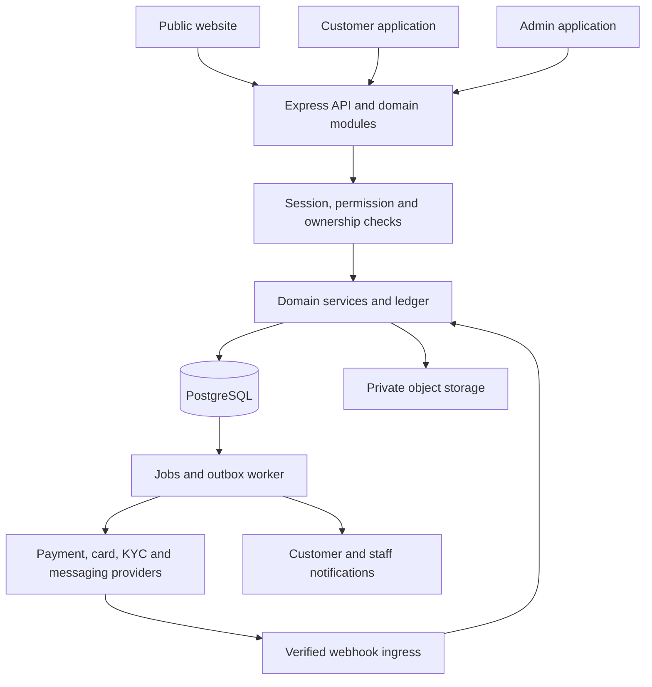

# Payvexis: complete implementation and system design

Date: 6 October 2026. Status: proposed design; application implementation has not started under this document.

## 1. Scope and assumptions

Extend the existing Payvexis codebase to cover the features documented in [the reference inventory](reference-site-feature-inventory.md) and [route evidence](reference-site-route-evidence.md), with a comprehensive administrative console. Those reports remain the evidence source; this document defines our implementation, including corrections and additional infrastructure needed to make the features work together.

The reference review found public pages and delivered customer/admin code. It did not verify the reference backend, successful payments, provider relationships, or regulatory claims. The design below is a proposal for Payvexis, not a description of that site's internal architecture.

Design assumptions:

- One Payvexis brand initially, with personal, joint, and business account ownership. Multiple currencies are supported by the model; USD is the initial enabled currency.
- Development starts in an explicitly labelled demo environment. Separate sandbox and live environments have separate credentials, databases, files, and provider accounts.
- Build every documented module, but enable provider-dependent products only when the relevant integration and operating arrangements exist. A menu entry or staff approval alone does not create a bank account, card, investment return, or completed external payment.
- Preserve existing branding and usable screens. Introduce new architecture incrementally; do not discard existing user changes.
- Admins receive extensive operational access through assigned permissions. Financial changes have an accountable approval process and permanent history.
- This is an implementation blueprint. Geography, providers, product terms, retention periods, and live launch requirements remain project decisions.

## 2. Target architecture

Use an **Express modular monolith**: one backend application with clearly separated domain modules, plus a background worker. This fits the existing Express project and keeps financial transactions within one database boundary.

| Layer | Proposed implementation | Responsibility |
|---|---|---|
| Public website | Existing HTML/CSS, compiled public assets, server-rendered published content | Marketing, product pages, contact, FAQ, policies, SEO |
| Customer application | React + TypeScript introduced under `/app`, shared design tokens | Authenticated account and product workflows |
| Admin application | React + TypeScript under `/admin`, shared UI package | Tables, review queues, detail workspaces, configuration, reports |
| API | Existing Express, progressively migrated to typed module boundaries | Validation, authorization, business rules, transactions |
| Database | PostgreSQL with versioned migrations | Accounts, ledger, workflow state, permissions, history |
| Worker | Separate Node process using durable PostgreSQL jobs/outbox | Notifications, exports, provider calls, scheduled processing, reconciliation |
| Session/rate-limit cache | Redis when deploying multiple application instances | Shared rate counters and short-lived cache; financial truth stays in PostgreSQL |
| Files | Private object storage plus separate public media bucket | KYC evidence, support attachments, receipts, CMS assets |
| Integrations | Adapter interfaces with demo, sandbox, and live implementations | Payments, card issuer, identity checks, email/SMS, market data, broker connectivity |
| Operations | Central logs, metrics, alerting, backups, secret manager | Recovery, observability, credential management |

React/TypeScript is a proposed migration choice for the growing customer/admin interfaces, not a requirement to rewrite all public pages. Move one workflow at a time; keep compatibility endpoints during transition.



Only `public/` and generated frontend build directories are served as static files. Database files, source, configuration, documents, backups, and uploads are outside the web root. Mount webhook handlers requiring raw request bodies before the ordinary JSON parser.

## 3. Complete feature implementation catalogue

Each row is a deliverable group. Lists within a row are included scope. CRUD means create, view, update, and archive where history must be preserved. All customer records require ownership checks; all staff actions require the relevant permission.

### 3.1 Public website and shared experience

| ID | Features | How implementation operates |
|---|---|---|
| PUB-01 | Responsive header, service menus, mobile navigation, footer, signed-in navigation | Shared navigation configuration; routes only appear when their feature is enabled; authenticated state comes from the session API. |
| PUB-02 | Brand name, logo, favicon, colors, theme, light/dark mode | Versioned brand settings; safe design tokens; user theme preference persisted. |
| PUB-03 | Homepage carousel, promotional cards, product sections, CTAs | CMS-managed ordered sections, accessible controls, pause/reduced-motion behavior, verified destinations. |
| PUB-04 | About, personal banking, business banking | Structured content and enabled product catalog; business applications save business-specific details. |
| PUB-05 | Loan catalog and repayment calculator | Product rates and terms feed an illustrative calculator; handle zero interest and invalid values; show assumptions. Final offers come from the server. |
| PUB-06 | Card catalog and comparisons | Programs include network, category, eligibility, fees, limits, benefits, and application links. |
| PUB-07 | Grant catalog and applications | Published programs link to authenticated applications; individual and company forms are distinct. |
| PUB-08 | Apps page | Publish actual store links when available. A downloadable native app is a separate deliverable; responsive web support is included. |
| PUB-09 | Contact form, contact details, opening hours, social links | Validated submission creates an inbox record; spam limits; staff replies through approved email delivery or a composed reply. |
| PUB-10 | FAQ categories, accordion, search | Ordered CMS records; bank-relevant content; accessible interaction. |
| PUB-11 | Privacy, terms, security, careers, custom pages | Versioned publication and effective dates; acceptance records for applicable terms. |
| PUB-12 | Translation, accessibility, SEO, error/loading/empty states | Local translation dictionaries for authenticated pages, keyboard navigation, semantic labels, metadata, real sitemap, consistent feedback. Avoid third-party translation scripts accessing private account pages. |

### 3.2 Identity and account access

| ID | Features | How implementation operates |
|---|---|---|
| IAM-01 | Four-step signup: personal, contact, account, security | Save first/middle/last name, username, email, phone, country, currency, account type, terms acceptance, referral attribution, and credentials through validated contracts. Never silently drop form fields. |
| IAM-02 | Login by email/username, show password, remember device | Server session with explicit lifetime; remember-me extends the refresh/session policy; step-up still required for sensitive operations. |
| IAM-03 | Email verification and resend | Single-use expiring hashed token, cooldown and abuse limits, verification history. |
| IAM-04 | Forgotten password and reset | Non-enumerating responses, single-use token/code, attempt limits, revoke existing sessions after reset. |
| IAM-05 | Authenticator MFA setup, QR/manual secret, challenge, recovery, disable | Encrypt enrolled secrets, hash recovery codes, require proof before enabling; staff MFA mandatory. Recovery and disabling are audited. |
| IAM-06 | Transaction PIN setup, change, recovery | Hash PIN, rate-limit attempts, require stronger recovery proof; bind transaction authorization to amount and destination. Never expose PINs to staff. |
| IAM-07 | Session list, logout, logout all, suspicious login alerts | Revocable server sessions; secure HttpOnly cookies, CSRF protection, idle/absolute expiry; separate staff session policy. |
| IAM-08 | Profile, avatar, notification preferences | Validate editable fields; identity changes requiring review create requests; private fields are redacted by role. |
| IAM-09 | Account restrictions and notices | Separate login, debit, credit, and product restrictions; mandatory acknowledgement records notice acceptance without removing actual restrictions. |
| IAM-10 | Personal, joint, and business ownership | Joint members accept invitations; organizations have owners, operators, viewers, and approval policies. A joint holder is a real user/membership, not a text field. |

### 3.3 Accounts, balances, records, and payments

| ID | Features | How implementation operates |
|---|---|---|
| BANK-01 | Dashboard, account details, fiat/crypto summaries, pending requests | Read models show posted balance, held funds, available balance, pending incoming funds, recent activity, quick actions, and real account identifiers. Aggregate currency totals identify valuation currency and rate time. |
| BANK-02 | Multiple accounts and wallets | Account membership and currency are separate from login identity; account opening and closure have status and eligibility checks. |
| BANK-03 | Transaction search, type/date/status filters, sorting, pagination | Server-side queries with stable cursor ordering; direction is explicit, independent of positive amount magnitude. UTC timestamps are displayed in user timezone. |
| BANK-04 | Receipts, reference/status/reason, balance after | Immutable settlement details with related status history; reverse entries link to originals; receipts never claim pending payments are completed. |
| BANK-05 | Statements, CSV export, print/PDF, email delivery | Export complete authorized date range through jobs; escape spreadsheet formulas; private expiring download links; timezone and currency stated. |
| BANK-06 | Member/internal transfers | Resolve and confirm permitted recipient details, quote fee, authorize, atomically debit sender and credit recipient; produce one operation and linked ledger entries. |
| BANK-07 | Local bank and international transfers | Destination-specific required fields, country/currency support, quote expiry, limits, review, authorization, hold, approval where required, provider dispatch, settlement tracking. |
| BANK-08 | Crypto, PayPal, Wise, Cash App, other destination labels | Enable a method only with a defined adapter or clearly labelled manual processing workflow. Validate supported network/address/memo; a label does not imply a provider integration. |
| BANK-09 | Saved beneficiaries, favorites, categories, usage statistics | CRUD with ownership, destination validation, masked display, recent-use statistics, and step-up for sensitive edits. |
| BANK-10 | Deposit methods, bank instructions, QR, proof upload, history | Versioned method schema defines required fields and limits. Evidence creates a pending request; verified settlement or approved reconciled evidence creates the credit once. |
| BANK-11 | Withdrawals, fee/ETA, bank/crypto destination, history | Validate available balance, hold amount plus fee, authorize, review, dispatch, settle; failed-before-settlement operations release the hold. |
| BANK-12 | Resume pending payment and additional verification | Resume an existing operation using its ID and server state; one-time user-bound challenge with expiry, attempt limits, and secure delivery. Staff see challenge status only. |
| BANK-13 | Bill payments and scheduled/recurring payments | Real payees, billing references, schedule, mandate/consent, due reminders, execution attempts, cancellation, failure handling, provider settlement. Do not route Pay Bills to international transfers. |
| BANK-14 | Currency exchange and swaps | Server-issued expiring quote with spread/fee, rounding and source; atomic cross-currency journals balanced separately through FX clearing accounts; demo quotes visibly labelled. |
| BANK-15 | Budgets, spending categories, charts | Categorization rules, editable categories, monthly budgets, progress and alerts computed from settled transactions. |
| BANK-16 | Refunds, reversals, disputes, reconciliation | Case workflow, reason and evidence, linked compensating journals, external provider state, discrepancy queue and independent approval. |

### 3.4 Cards and financial products

| ID | Features | How implementation operates |
|---|---|---|
| PROD-01 | Card list/details, masked number, holder, expiry, spending, transactions | Issuer references and non-sensitive metadata stored locally; controlled issuer-hosted reveal when available. Do not store raw CVV. |
| PROD-02 | Apply for card: brand, tier, currency, limit, billing details, terms | Persist all fields; eligibility and approval rules; issuer request; pending/active/rejected lifecycle. Network selection remains accurate. |
| PROD-03 | Freeze/unfreeze, nickname/theme, spending controls, limits | Server validates allowed changes; issuer acknowledgement updates effective controls; pending/error state stays visible on failure. |
| PROD-04 | Card funding, fees, authorizations, settlement, refunds, disputes | Provider events drive holds and postings. Demo-only simulated spends use the same domain service and remain identified as simulated. |
| PROD-05 | Loan products and applications | Product terms, min/max, purpose, income, documents, review, approved offer, acceptance, disbursement, repayment schedule, accrued charges, repayments, arrears, payoff. |
| PROD-06 | Grant programs and applications | Individual/company schemas, program eligibility, amount, purpose, documents; approve award separately from disbursement and record funding source. |
| PROD-07 | Tax-refund assistance cases | Tax year, amount, filing reference, documents, eligibility, disclosed fees, case review and verified payout tracking. Internal case status must not be presented as an official IRS determination. |
| PROD-08 | Product families advertised by reference | Checking, savings, money market, CDs, retirement/youth accounts, home/auto/personal/business/student/equity loans, card categories. Use a product catalog with eligibility, terms, fees, limits, interest schedules, maturity and ownership rules; enable actual servicing only for implemented products. |
| PROD-09 | Business services advertised by reference | Business onboarding, employee memberships/cards, payment approvals, reporting; merchant settlement and treasury capabilities require their own provider adapters and reconciliation. |
| PROD-10 | Check deposits and named payment networks advertised by reference | Separate image/evidence capture, endorsement instructions, duplicate detection, provider submission, review, holds and return workflow. Network services such as Zelle require confirmed availability; do not emulate branded network completion. |

### 3.5 Identity checks, engagement, and optional modules

| ID | Features | How implementation operates |
|---|---|---|
| SERV-01 | KYC application and resubmission | Identity, DOB, contact/address, employment/income and next-of-kin fields when required; document front/back/selfie; consent; review notes and outcomes; data minimization by product. |
| SERV-02 | Notifications | Read/unread, archive/delete from personal view, preferences, transactional email and optional SMS, delivery records and retry rules. |
| SERV-03 | Referrals | Code/link, attribution, counts, level 1–3 network where enabled, qualification rules, reward history, fraud checks, approved payouts. |
| SERV-04 | Support tickets | Categories, subject, threaded replies, attachments, assignment, open/in-progress/resolved/reopened states, staff-only notes and response history. |
| SERV-05 | Customer and guest chat | Scoped guest conversation token or customer session, messages, safe attachments, unread/read state, optional sound, close/reopen; SSE with polling fallback. |
| SERV-06 | Wallet address book | Named wallet/provider labels, network and address verification. Saving an address does not connect a wallet; actual ownership proof is a separate challenge flow. |
| EXT-01 | Investment plan catalog, subscriptions, maturity, payouts, switching | Versioned terms, allocation, lifecycle, valuation, documented payout basis, approved payout journals, cancellation and prorated-switch policy. Demo returns are explicitly simulated; real performance comes from verified sources. |
| EXT-02 | Crypto asset catalog and valuation | Symbol, network, precision, price source/time, enabled status; no fabricated market price in live mode. Custody/trading adapters are separate capabilities. |
| EXT-03 | Trading signals | Asset, direction, entry, targets, stop loss, publish/close/result, subscription fee, subscriber access, optional Telegram distribution and delivery history. |
| EXT-04 | Signal providers, earnings and payouts | Provider commission rules and earnings ledger; payout approval plus actual disbursement tracking. Bookkeeping status and money movement are distinct. |
| EXT-05 | Copy trading | Master profiles, strategy, fees, allocation, follow/stop, subscriber history; broker-authorized delegated connection. Never collect raw MT4 passwords as a substitute for an integration. |
| EXT-06 | Membership tiers | Price, duration, badge, entitlements, purchase, activation, expiry, cancellation/renewal policy and refund handling. |
| EXT-07 | Courses | Catalog, pricing, enrollment, ordered lessons, video/body content, progress, completion; enforce enrollment server-side. |

### 3.6 Full administrative console

The admin console should have a persistent navigation tree, global search constrained by permissions, saved filters, export jobs, review queues, and a customer detail workspace. Every mutation displays the real result and refreshes affected records.

| ID | Admin area | Access and operations |
|---|---|---|
| ADM-01 | Staff authentication | Staff login, MFA/recovery, session review/revocation, invitation and deactivation. |
| ADM-02 | Overview | Users, balances by currency, pending KYC/payments/products, settlement totals, support workload, failed jobs and reconciliation alerts; permission-filtered statistics. |
| ADM-03 | Customer directory and detail | Search/filter, profile, ownerships, accounts, products, activity, documents, cases, notes, restrictions and audit timeline. |
| ADM-04 | Customer creation/import | Invite user to set password; CSV upload, proper quoted-field parser, preview, validation, duplicate report, dry run, import job and row errors. Imported opening money requires a separate approved funding/migration workflow. |
| ADM-05 | Customer controls | Suspend/reactivate, debit/credit restrictions, revoke sessions, request password/MFA recovery, permit reviewed profile changes, close account with prerequisites. Preserve financial records. |
| ADM-06 | KYC workspace | Assigned queue, private document viewing, review checklists, approve/reject/request-more-information with reason, expiry and resubmissions. |
| ADM-07 | Leads and agents | Lead source/contact/assignee/status/notes; agent directory contact/notes/active state. Agent records do not automatically grant staff login. |
| ADM-08 | Tasks and calendar | Create, assign, due date, description, priority, status, list/calendar filters and reminders. |
| ADM-09 | Accounts and ledger | View ledger and holds, trace operation, reconciliation, propose adjustment, approve eligible adjustment, release eligible holds, request closure. |
| ADM-10 | Deposit review | Proof and settlement evidence, method, amount, matching, approve/reject; credit once; settled monetary fields require a reversal/correction workflow. |
| ADM-11 | Withdrawal review | Pending verification, review/approve/reject, provider dispatch and history, cancel when allowed, failed/refund cases. Verification policies configurable; OTP secrets are not displayed. |
| ADM-12 | Transfer operations | Internal/local/international queues, approval, rejection, eligible cancellation, provider status, reversal request and investigation. |
| ADM-13 | Payment method builder | Deposit/withdraw/transfer applicability, order, enabled state, icons/QR, instructions, limits, fee rules, ETA; typed fields: text, number, select, date, file, display-only instructions, required flags, hints and choices. Version active submissions. |
| ADM-14 | Cards and programs | Review applications, issue through adapter, block/unblock, permitted limits, funding, transaction investigation, monthly fees/daily/ATM limits, manual/automatic approval policy. |
| ADM-15 | Currencies and exchange | Code/symbol/precision, enabled state, supported methods, rate source/spread; archive unused currencies, never delete currencies referenced by postings. |
| ADM-16 | Loans | Product terms, application review, approved offer, disbursement approval, schedules, repayments, collections cases and notes. |
| ADM-17 | Grants and refund cases | Program configuration, eligibility, applications, decisions, separate disbursement, case notes, disclosed fee policy and evidence. |
| ADM-18 | Referral administration | Attribution/network, qualification, reward rules, abuse review, reasoned reward adjustment and payout approval/history. |
| ADM-19 | Investment administration | Plan terms, subscriptions, verified valuations, payout proposals, maturity/principal return and cancellation workflows. |
| ADM-20 | Crypto administration | Asset catalog, network/precision, enabled state, provider mapping, price freshness monitoring; demo price configuration isolated from live. |
| ADM-21 | Signals/provider administration | Signal CRUD, publish/close/result, rebroadcast, subscription pricing, Telegram integration test, providers/commissions/earnings/payouts. Secrets managed outside content fields. |
| ADM-22 | Copy-trading administration | Masters/strategies/fees, subscriber allocations, connection health, execution exceptions and stop requests. |
| ADM-23 | Membership administration | Tier CRUD, price/duration/badge, entitlements, subscriptions and controlled refunds. |
| ADM-24 | Course administration | Course CRUD, publish status, price/cover, ordered lessons/video/body/duration and enrollment/completion reporting. |
| ADM-25 | Contact inbox | All/unread views, mark read, assign, reply, archive; retention-based deletion for eligible non-financial content. |
| ADM-26 | Support and chat workspace | Queues, assignment, replies, attachments, internal notes, resolve/reopen/close, unread count and service metrics. |
| ADM-27 | Broadcasts | Segments: active, KYC verified/unverified, positive balance, inactive 30 days, selected users; in-app/email/both; preview recipient count, approval, send job, history and delivery metrics; honor applicable preferences/suppression. |
| ADM-28 | Contact/support configuration | Public contacts/hours/socials, built-in chat or approved provider integration, widget position and sound; allowlisted integrations rather than arbitrary executable embed code. |
| ADM-29 | Testimonials | Quote, attribution/photo, display order, publication and consent record. |
| ADM-30 | Appearance and themes | Brand assets, hero/CTA preview, theme CRUD/activation and versioned design tokens; avoid unrestricted script/CSS injection. |
| ADM-31 | Media library | Upload, metadata, image/video URL, copy reference, usage count and archive; private evidence stays outside the public media library. |
| ADM-32 | Page editor | Structured text/images/links, hide/reorder sections, draft/preview/publish, revisions, duplicate/reset/restore; reset creates a new version. |
| ADM-33 | Content and FAQ | About/terms/privacy/contact/careers/home/custom content, sanitized rich text, FAQ CRUD/categories/order and publication scheduling. |
| ADM-34 | Staff, roles and permissions | Invite, role assignment within actor's authority, permission scopes, approval thresholds, access review, deactivation; no self-promotion. |
| ADM-35 | Audit and reports | Staff actions, logins, sensitive reads/exports, financial history, filters and export; append-only application access plus protected external archive. |
| ADM-36 | System configuration | Product flags, notification recipients/events, limits, fees, retention policy references, integration health, jobs and failed-delivery queues; secret values remain masked. |

Legacy duplicate routes, including the old withdrawal-method editor, become redirects into the unified module. They do not require duplicate implementations.

## 4. Admin authority and permissions

Use role-based permissions plus record scope and operation rules. Every API request checks authorization; hiding a button is presentation only. This follows the deny-by-default and per-request authorization guidance in [OWASP's authorization guidance](https://cheatsheetseries.owasp.org/cheatsheets/Authorization_Cheat_Sheet.html).

| Role | Default responsibilities | Sensitive restrictions |
|---|---|---|
| Owner | Staff governance, integrations, global settings, product activation, oversight | Cannot alter audit history, view credentials, or self-approve a financial proposal |
| Platform administrator | Customer operations, workflow configuration, system health | Financial approval requires an additional assigned permission |
| Finance operator | Payment queues, reconciliation, propose adjustments/refunds/disbursements | Cannot approve own proposals |
| Finance approver | Approve/reject within amount/currency scope | Independent actor; high-value thresholds may require two approvers |
| Compliance/KYC reviewer | Identity documents, identity decisions, restrictions, risk cases | No unrestricted balance adjustment or content administration |
| Support specialist | Customer summary, tickets/chat, masked transactions, recovery initiation | No secret access, money movement, or unilateral MFA removal |
| Product manager | Products, fees, plans, card programs, entitlements | Material terms changes require review and versioning |
| Content/marketing editor | Pages, themes, FAQ, testimonials, draft campaigns | No KYC evidence or unrestricted financial exports |
| Auditor | Read-only authorized history, reports and audit exports | No operational mutation |

Permission names are explicit: `users.read`, `users.restrict`, `kyc.documents.read`, `kyc.decide`, `payments.review`, `payments.approve`, `ledger.adjust.propose`, `ledger.adjust.approve`, `cards.manage`, `staff.manage`, `cms.publish`, `broadcasts.send`, `audit.export`, `integrations.configure`.

Permission assignments carry scope: organization, product, currency, amount ceiling, and permitted record class as needed. Limits aggregate related attempts to prevent bypass through payment splitting. Sensitive exports require purpose and audit. Any optional support impersonation is read-only, time-limited, visibly labelled and reason-logged; money movement and security changes remain unavailable in that mode.

**Adjustment example:** operator selects account, debit/credit, amount, reason and evidence -> server creates proposal -> a different authorized staff member approves -> ledger transaction posts balanced entries -> both actors, evidence and customer notification are recorded. Admins can resolve errors without editing `users.balance` directly.

Emergency access is temporary, explicitly granted, logged and reviewed; it cannot bypass ledger balance constraints or erase records.

## 5. Money model and transaction rules

### 5.1 Ledger

Replace mutable floating-point balances with an immutable double-entry ledger.

- `ledger_accounts` represent customer liabilities, settlement assets, fees, funding, receivables and clearing accounts with explicit normal-balance rules.
- Each journal has two or more postings whose signed values sum to zero **per currency**. Posting commits and finalizing the journal happen in one transaction through a constrained posting function; ordinary application roles cannot update/delete posted entries.
- Fiat values use integer minor units. Crypto uses its configured atomic precision with integer numeric storage large enough for the asset. API amounts are strings; JavaScript floating-point arithmetic is never authoritative for money.
- Example internal transfer of USD 10 plus USD 1 fee: decrease sender entitlement by 1100 cents, increase recipient entitlement by 1000 cents, credit fee revenue by 100 cents, using the ledger accounts' correct debit/credit signs.
- `available = posted spendable balance - active holds`; pending incoming money is separate. Creating a hold does not also post the final debit. Settlement consumes the hold and posts exactly once.
- Corrections create linked compensating journals. Financial accounts and posted journals cannot be cascade-deleted with a user.
- Cached balance rows are projections updated in the same transaction and checked against the ledger. They are not independent editable balances.

### 5.2 Concurrency and idempotency

For each money command: authenticate -> authorize -> validate -> claim idempotency key -> begin transaction -> lock affected account balance rows in a stable order -> recheck balance/limits/current state -> create hold or journal -> update operation -> add audit and outbox events -> commit -> return committed result.

Use a unique `(actor, operation type, idempotency key)` record with a request hash. Repeating the same request returns the original result; using the key with different input returns a conflict. Retry deadlocks/serialization failures with a bounded policy. PostgreSQL documents how row locks coordinate concurrent updates and why consistent lock ordering matters in [its locking documentation](https://www.postgresql.org/docs/current/explicit-locking.html).

External network calls happen outside database locks. An outbox worker sends an operation using the same provider idempotency reference. Timeouts become `unknown/awaiting_reconciliation`, not an automatic failed-and-refunded payment. Do not dispatch a replacement until the outcome is resolved.

### 5.3 Workflow states

| Workflow | Main transitions | Financial consequence |
|---|---|---|
| Internal transfer | draft -> authorized -> settled; rejected before commit | Atomic sender/recipient/fee postings |
| External transfer/withdrawal | draft -> quoted -> authorized -> held -> pending_review -> dispatching -> submitted -> settled | Hold before dispatch; settle once on verified outcome |
| External exception | held -> rejected/cancelled/expired; submitted -> reconciliation_required/returned | Release undispatched holds; settled returns use reversal journals |
| Deposit | submitted -> evidence_review/provider_pending -> settled or rejected | Credit on verified settlement; never on upload alone |
| Card payment | authorized -> captured; authorized -> expired/reversed; captured -> refunded/disputed | Authorization hold, capture posting, later independent correction |
| Loan | draft -> submitted -> reviewing -> offered -> accepted -> disbursing -> active -> paid/arrears/closed | Disbursement and repayment journals with schedule tracking |
| Grant/refund case | submitted -> reviewing -> approved -> disbursing -> paid; rejected | Approval creates entitlement/workflow; payout is separately evidenced |
| KYC | draft -> submitted -> reviewing -> more_information/approved/rejected/expired | Eligibility and restrictions change through policy |

Automatic review may skip `pending_review` when policy permits. Every transition has allowed actors, prerequisites and a version check. Final states cannot be arbitrarily patched from the admin UI. Store separate requested, authorized, dispatched and settled timestamps.

### 5.4 Provider callbacks and reconciliation

Verify callback authenticity using each provider's documented mechanism, preserve required raw-body handling, reject stale/replayed events where supported, store a unique event ID, and tolerate retries and out-of-order delivery. Acknowledge only after durable receipt; process asynchronously. [Stripe's webhook documentation](https://docs.stripe.com/webhooks) illustrates these delivery and signature considerations; Stripe is not selected here as the provider for every product.

Reconcile provider settlements, fees, returns and balances against internal operations on a schedule. Put mismatches in a staff queue with evidence and resolution history. Duplicate delivery must never produce duplicate credit, debit or notification billing.

## 6. Database design

All domain records have stable IDs, timestamps and appropriate status/version fields. PII access and encryption are field-specific. Historical terms and financial evidence remain linked to their effective version.

| Domain | Main tables and relationships |
|---|---|
| Identity | `users`, `user_profiles`, `addresses`, `credentials`, `sessions`, `mfa_factors`, `recovery_codes`, `verification_challenges`, `consent_acceptances`, `security_events` |
| Ownership | `organizations`, `organization_memberships`, `accounts`, `account_memberships`, `account_restrictions`; users may own multiple accounts and share one account |
| Staff access | `staff_profiles`, `roles`, `permissions`, `role_permissions`, `staff_role_assignments`, `approval_policies`, `access_reviews` |
| Ledger | `currencies`, `ledger_accounts`, `journals`, `postings`, `balance_projections`, `holds`, `adjustment_proposals`; journals link to business operation IDs |
| Payments | `payment_operations`, `payment_status_events`, `beneficiaries`, `payment_methods`, `payment_method_versions`, `payment_method_fields`, `payment_evidence`, `fx_quotes`, `bill_payees`, `payment_schedules`, `schedule_executions` |
| Provider integration | `provider_connections`, `provider_objects`, `webhook_events`, `reconciliation_runs`, `reconciliation_items`, `idempotency_records`; credentials referenced from secret manager |
| Cards | `card_programs`, `card_applications`, `cards`, `card_controls`, `card_authorizations`, `card_transactions`, `card_disputes` |
| Products | `products`, `product_versions`, `eligibility_rules`, `fee_rules`, `interest_schedules`, `term_deposits`, `maturities`, `loan_applications`, `loans`, `loan_installments`, `loan_repayments`, `grant_programs`, `grant_applications`, `refund_cases` |
| Identity review | `kyc_cases`, `kyc_documents`, `kyc_reviews`, `risk_cases`, `review_assignments` |
| Engagement | `notification_preferences`, `notifications`, `message_deliveries`, `contact_messages`, `support_tickets`, `support_messages`, `chat_conversations`, `chat_messages`, `conversation_participants` |
| Referral/operations | `referral_codes`, `referral_relationships`, `referral_rules`, `reward_accruals`, `reward_payouts`, `leads`, `agents`, `tasks`, `task_assignments` |
| Investments/trading | `investment_plans`, `investment_positions`, `valuations`, `investment_payouts`, `crypto_assets`, `wallet_addresses`, `signals`, `signal_subscriptions`, `signal_providers`, `commission_accruals`, `provider_payouts`, `copy_masters`, `copy_allocations`, `broker_connections` |
| Membership/learning | `membership_tiers`, `memberships`, `entitlements`, `courses`, `lessons`, `enrollments`, `lesson_progress` |
| CMS | `site_settings`, `themes`, `pages`, `page_revisions`, `page_sections`, `public_media`, `faqs`, `testimonials`, `broadcasts`, `broadcast_recipients` |
| Shared infrastructure | `private_files`, `audit_events`, `approval_requests`, `approval_decisions`, `outbox_events`, `jobs`, `job_attempts`, `export_jobs`, `feature_flags`, `migration_mappings`, `legacy_transactions` |

Important constraints: unique normalized email/username; unique provider event and external operation references; one effective settlement journal per operation; unique scheduled execution per schedule/due-time; valid currency precision; no empty journal; correct posting balance at commit; nonnegative available balance unless an explicit credit facility permits it; foreign keys with restrictive deletion for financial records.

Index ownership and common queue/filter keys, including `(account_id, created_at, id)`, `(status, created_at)`, `(user_id, status)` and `(provider, external_id)`. Use optimistic version checks on review decisions and configuration edits. Business organization IDs scope ownership; they are not a claim that this first release is a multitenant SaaS platform.

## 7. API contracts

Use `/api/v1` for customer/public endpoints, `/api/v1/admin` for staff, and `/api/v1/webhooks/{provider}` for callbacks. Maintain an OpenAPI contract and shared generated types. Each module implements validation, permissions, service, repository and event handlers.

| Module | Customer/public endpoints, relative to `/api/v1` | Staff endpoints, relative to `/api/v1/admin` |
|---|---|---|
| Identity | `auth/register`, `auth/login`, `auth/logout`, `auth/me`, `auth/verify-email`, `auth/password-reset`, `auth/mfa/*`, `auth/pin/*`, `sessions`, `profile` | `staff`, `roles`, `permissions`, `users/{id}/restrictions`, `users/{id}/recovery-requests` |
| Accounts | `accounts`, `accounts/{id}`, `accounts/{id}/members`, `dashboard`, `budgets` | `users`, `users/{id}`, `accounts`, `imports`, `ledger`, `adjustment-proposals` |
| Records | `transactions`, `transactions/{id}`, `statements`, `exports` | `transactions`, `exports`, `reconciliations`, `disputes` |
| Payments | `payment-methods`, `beneficiaries`, `transfers/quotes`, `transfers`, `deposits`, `withdrawals`, `payments/{id}/authorize`, `payments/{id}/cancel` | `payments`, `payments/{id}/decisions`, `payment-methods`, `payment-methods/{id}/versions` |
| Bills/FX | `bill-payees`, `payment-schedules`, `fx/quotes`, `fx/swaps` | `payment-schedules`, `currencies`, `fx-settings` |
| Cards | `card-programs`, `card-applications`, `cards`, `cards/{id}/controls`, `cards/{id}/reveal-session`, `cards/{id}/disputes` | `card-applications`, `cards`, `card-programs`, `card-disputes` |
| Products | `products`, `loan-applications`, `loans`, `grant-programs`, `grant-applications`, `refund-cases` | `products`, `loans`, `grants`, `refund-cases`, `disbursement-proposals` |
| Identity review | `kyc/cases`, `kyc/cases/{id}/submit`, `files/upload-intents` | `kyc/cases`, `kyc/cases/{id}/decisions`, `risk-cases` |
| Engagement | `notifications`, `support/tickets`, `support/tickets/{id}/messages`, `chat/conversations`, `referrals` | `support`, `chat`, `contacts`, `referrals`, `leads`, `agents`, `tasks`, `broadcasts` |
| Optional modules | `investments`, `crypto-assets`, `wallet-addresses`, `signals`, `copy-trading`, `memberships`, `courses` with resource-specific subroutes | Matching management resources plus `payout-proposals`, `providers`, `commissions` |
| Website/system | `site`, `pages/{slug}`, `faqs`, `contact`, `events` | `cms/*`, `media`, `themes`, `settings`, `feature-flags`, `audit`, `jobs`, `integrations`, `approvals` |

Conventions: GET reads; POST creates or runs a named state transition; PATCH edits permitted non-final fields; DELETE archives eligible resources. Never accept a generic status patch for settlement. Paginated responses include cursor and applied filters. Errors include stable code, safe message, field errors and request ID. Financial creation/decision requests require idempotency keys.

Example transfer command: `{ sourceAccountId, beneficiaryId, amountMinor: "10000", currency: "USD", quoteId, authorizationId }`. The server revalidates the quote, destination, ownership, restrictions and available funds. Clients cannot choose ledger postings, approval state, role, or final fee.

The registry above defines endpoint families; implementation adds request/response schemas and transition-specific contracts before coding each module.

## 8. Frontend implementation plan

Shared components: application shell, permission-aware navigation, form fields, validation summary, amount/currency input, date range, searchable tables, server pagination, status badge, review drawer, confirmation dialog, file upload, audit timeline, chart, notification panel and error boundary.

Customer navigation: Overview; Accounts; Activity/Statements; Transfer; Deposit; Withdraw; Bills; Beneficiaries; Cards; Exchange; Budgets; Loans; Grants; Refund Cases; Identity; Support; Notifications; Referrals; Profile/Security. Optional Investments, Crypto, Signals, Copy Trading, Membership and Courses appear when enabled.

Admin navigation: Overview; Customers; Accounts/Ledger; Payments; Cards; Products; KYC/Risk; Support/Chat; CRM/Tasks; Referrals; Investments/Trading; Learning/Membership; Content/Appearance; Communications; Staff/Permissions; Reports/Audit; System.

Customer detail workspace tabs: Summary, Profile, Account Members, Balances/Holds, Transactions, Payment Requests, Cards, Products, Identity Documents, Support, Notes, Restrictions, Security Events and Audit. Each tab and action is independently permission checked.

Standard money screen flow: input -> server quote -> review amount/fee/total/destination -> authorization -> submit once -> pending/settled receipt. Refreshing the page recovers server state. Failed saves remain errors; success appears only after the server confirms. Multi-currency totals show their conversion basis.

Use locally maintained translations and locale-aware formatting. User data is rendered as text by default; sanitize permitted rich content. Private files use authenticated authorization checks followed by short-lived links; validate content type/size, scan uploads and quarantine failures. KYC/selfie files are never public CMS assets.

## 9. Mapping to the existing codebase

| Existing files | Planned change |
|---|---|
| `server/index.js` | Serve only approved public/build paths; API versioning; session/CSRF setup; raw webhook routing; health/readiness; graceful worker-aware shutdown |
| `server/config.js` | Validated environment schema; explicit demo/sandbox/live configuration; secret references; no live default credentials |
| `server/database.js` | Replace startup schema mutation/seeding with versioned migrations and PostgreSQL repositories; demo data only through explicit demo seed command |
| `server/routes/auth.js`, auth/admin middleware | Session lifecycle, MFA/verification/PIN, permission middleware, ownership checks, recovery workflows |
| `server/routes/accounts.js` | Multiple accounts/members, ledger projections, profile separation, validated card/account controls |
| `server/routes/transactions.js` | Ledger-backed records, real internal credit/debit transfer, payment state machines, full statements/exports |
| `server/routes/admin.js` | Split into domain admin controllers; review queues and granular permissions replace one coarse admin gate |
| `server/routes/support.js` | Threads, attachments, staff replies/assignment, private notes, state history, chat integration |
| `server/routes/exchange.js` | Rate adapter and expiring execution quotes; rates alone do not execute FX |
| `dashboard.js` | Repair current submit wiring; migrate summary/actions to typed APIs and then `/app` components |
| `dashboard-activity.js` | Fix direction/date contract, server filters and pagination, complete exports |
| `dashboard-cards.js`, `card.js` | Normalize `cardLimit` contract, persist all permitted controls, accurate failure states, issuer-backed lifecycle |
| `admin.js/html/css` | Gradually replace monolithic screen with admin shell and modules; escape all user content |
| `login.js`, `open-account.js`, other auth consumers | Shared API/session client; correct sign-out; complete registration field persistence |
| `index.html`, public product/support pages, `translate.js` | Keep presentation where useful, connect published CMS/products, replace placeholders, scope translation safely |

Suggested structure:

```text
apps/
  customer/src/{pages,features,components}
  admin/src/{pages,features,components}
packages/
  ui/
  contracts/
public/                       # public assets only
server/
  app.ts
  modules/
    identity/ access/ accounts/ ledger/ payments/ cards/
    products/ kyc/ support/ notifications/ referrals/
    investments/ trading/ learning/ cms/ operations/
  integrations/{payments,cards,kyc,messaging,market-data,brokers}/
  infrastructure/{database,files,sessions,jobs,observability}/
  workers/
  migrations/
  tests/
docs/
```

Each domain module contains routes, schemas, service, repository and events. Its staff routes call the same domain service as automated/provider flows; they do not maintain separate monetary logic.

## 10. Existing defects to resolve first

These are findings carried forward from the local review, not claims about the reference site:

1. Serving the project root makes server/database files reachable. Move static serving to a strict public directory immediately.
2. Logout leaves the actual token behind on customer pages. Centralize session clearing/revocation and migrate away from browser-local bearer storage.
3. Default demo user creation can occur in production. Remove automatic production seeding and fixed credentials.
4. The transfer backend deducts the sender without crediting a recipient or executing an external transfer. Route through the new ledger/payment model before enabling real transfers.
5. The dashboard transfer action does not submit the expected API request. Repair it against a verified backend flow.
6. Activity classification treats positive stored amounts as incoming and reads the wrong date field. Standardize explicit direction and timestamp contracts.
7. Card field names/control persistence differ between frontend and backend; some failures appear successful. Normalize schema and response handling.
8. Admin user data is interpolated into HTML. Replace unsafe rendering and validate all mutations.
9. REAL/JavaScript floating-point amounts and cascading financial deletion need replacement before live money use.
10. Generic rate limiting, coarse admin roles and basic support records need the scoped controls and richer models defined above.

## 11. Data migration and rollout

1. Inventory actual records and take an encrypted restorable backup. Record source counts, balances, currencies and hashes for migration verification.
2. Add versioned migrations and create the new schema alongside existing data. Preserve legacy IDs through mapping tables.
3. Map each existing customer to a user and initial account; map joint text details to pending membership invitations, without inventing verified identities.
4. Convert REAL balances to integer minor units with an explicit rounding policy. Quarantine ambiguous values and discrepancies for review.
5. Establish approved opening ledger balances against a documented migration clearing/funding account. Do not infer missing historical counterparties from the incomplete transaction log.
6. Import legacy transactions as labelled read-only history. Do not post them again on top of opening balances. Reconcile historical completeness separately.
7. Map cards, spending budgets, tickets and audit records. Reset sensitive credentials/sessions where the new security model requires it; retain valid password hashes with gradual rehash policy.
8. Run migration dry runs and compare per-account totals, hold totals, record counts and ownership. Resolve every financial discrepancy before cutover.
9. Put financial writes in maintenance mode, take a final snapshot, run final delta migration, reconcile, switch the application and smoke-test.
10. Before new financial writes, rollback can restore the old snapshot. After new postings or external dispatch, recover through reconciliation/forward fixes; never erase committed movements by restoring an old database blindly.

Avoid prolonged dual writing of balances. Keep temporary read/API adapters where needed, with one authoritative financial writer at every stage.

## 12. Build order and acceptance gates

| Phase | Deliverables | Gate before continuing |
|---|---|---|
| 0: Stabilize | Static isolation, seed removal, logout, transfer disabling/fix path, activity/card contracts, safe admin rendering | Private paths inaccessible; known incorrect money actions cannot run; existing public flows remain usable |
| 1: Platform | PostgreSQL migrations, identity/session/MFA, roles, files, audit, jobs/outbox, typed API/UI foundations | Ownership and permission tests; session revocation; private-file authorization; backup restoration |
| 2: Financial core | Accounts/members, ledger, holds, internal transfers, beneficiaries, history, receipts/statements, adjustment approval | Balanced journals; no overdraft under concurrent requests; retry produces one result; independent approval enforced |
| 3: Payments/cards | Deposit/withdraw/external-transfer adapters, methods builder, FX, bills, card lifecycle, reconciliation | Sandbox settlement/rejection/timeout/return tests; duplicate/out-of-order callbacks; no premature completion |
| 4: Customer products | KYC, loans/repayments, grants, refund cases, product catalog, business roles, budgets, referrals | Terms/eligibility persisted; review and disbursement distinct; repayment and reward calculations verified |
| 5: Operations/content | Full customer admin workspace, CRM/tasks, support/chat, inbox/broadcasts, notifications, CMS/themes/media/FAQ/testimonials, exports | Permission matrix checks; staff/customer message privacy; publication rollback; delivery retries and suppression |
| 6: Extended modules | Investments, crypto, signals/providers, copy trading, memberships, courses; advanced advertised product servicing | Entitlement enforcement, correct subscription lifecycle, verified payout source, adapter support or explicit demo restriction |
| 7: Live readiness | Selected provider onboarding, production isolation, monitoring, incident procedures, recovery drill, capacity verification | Product-specific operational sign-off; reconciliation clean; secrets and live flags restricted; restore exercise meets agreed objectives |

Phases 4–6 reuse the core and can be scheduled by product priority after dependencies pass. Do not estimate a delivery date without team size, provider access and selected live scope.

## 13. Verification, operations and delivery definition

Required meaningful tests:

- Ledger invariants, rounding at currency boundaries, zero/negative/overflow rejection, fee allocation and compensating entries.
- Two concurrent transfers competing for the same balance; duplicate approvals; simultaneous cancel/settle; expired quote/challenge; scheduled-payment retry.
- Request idempotency, provider timeout, callback replay, out-of-order delivery, worker crash after provider acceptance and before local acknowledgement.
- Permission matrix and cross-customer access attempts for records, attachments, exports, chat and cards; staff privilege escalation and self-approval rejection.
- Signup fields, remember-me policy, verification, MFA recovery, logout-all, restrictions, failed form saves and resumed requests.
- Full-range statements, explicit transaction direction/timestamps, safe CSV, CMS sanitization, accessible critical screens and mobile navigation.
- Migration reconciliation and backup restoration. Provider sandbox journeys for every enabled external capability.

Operational dashboards track API errors/latency, login abuse, job age/retries, callback processing, unsettled-operation age, reconciliation differences, negative-available anomalies, audit pipeline health and support response times. Logs carry correlation IDs and redact credentials, PINs, tokens, document contents and sensitive card data.

Daily reconciliation and scheduled backups are minimum planned routines; choose exact schedules and retention by business requirements. Proposed initial recovery targets are RPO <= 15 minutes and RTO <= 4 hours, subject to validation and provider/database capabilities. Alert thresholds, load targets and capacity budgets must be established from expected usage.

A module is complete only when its customer/admin UI, API validation, ownership/permissions, persistence, state transitions, audit trail, error/retry handling and relevant tests work together. Provider-dependent completion also requires sandbox evidence and reconciliation. A visible page alone does not satisfy delivery.

## 14. Decisions needed before live scope is finalized

- Operating countries, entity and actual product availability.
- Payment rails, banking/custody partners, card issuer, identity verification and messaging providers.
- Supported currencies/networks, account products, limits, fee schedules and settlement expectations.
- Whether advanced investment/trading/crypto modules launch as demo or supported live products.
- Staff assignments, approval thresholds, business/joint account signing rules and recovery policy.
- Privacy/data residency/retention requirements, expected users/transaction volume, hosting budget and recovery targets.
- Native mobile apps versus responsive web only; merchant/treasury/network integrations prioritized for later releases.

Until these decisions are made, implement the complete module structure using explicit demo adapters, deterministic test fixtures and feature flags. Production activation is a controlled deployment decision with separate credentials and evidence, not an unrestricted admin toggle.

## 15. Recommended first implementation package

Start with Phase 0 and Phase 1, then complete one end-to-end internal transfer: secure sign-in -> account -> beneficiary -> quote/review -> authorize -> balanced posting -> customer receipt -> admin trace -> audit history. This establishes the reusable foundation for deposits, withdrawals, cards, products and all subsequent admin workflows.
